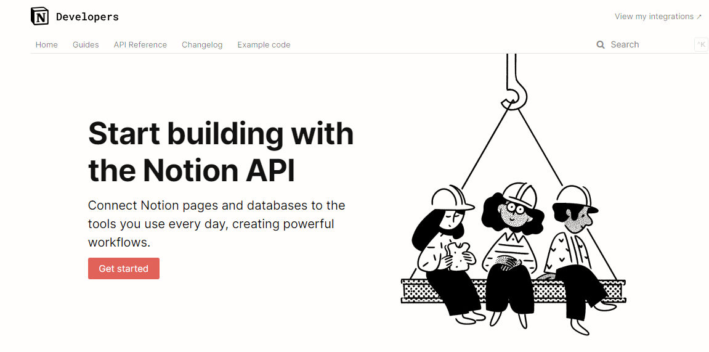

## Notion Api Getting Started

This is a sample application of how to use the Notion API to query the database. It uses the Next.js framework with React. Follow the instructions below to set it up.



1. Clone this repository
2. Navigate into the project directory

    ```bash
    cd notion-dev
    ```
3. Install the requirements
    ```bash
    npm i
    ```

4. Make environment variables file
    ```bash
    NOTION_API_KEY=
    ```

5. Run de Proyect

    ```bash
    npm run dev
    ```
